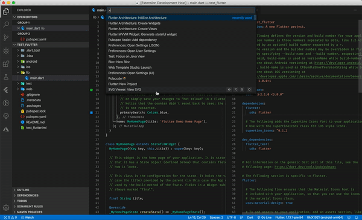
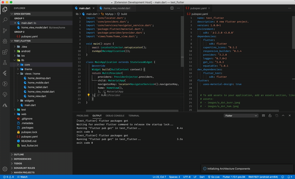

# Flutter MVVM Architecture Generator

VsCode extension to generate boilerplate code when using [FilledStacks' responsive architecture](https://www.filledstacks.com/tutorials) using Providers

## Features

### Initialize Architecture

Initialize the project with the following project structure:

```bash
--root
    |-- android
    |-- build
    |-- ios
    |-- lib
        |-- core
            |-- base
                |-- base_model.dart
                |-- base_service.dart
                |-- base_view_model.dart
            |-- models
            |-- services
                |-- navigation_service.dart
            locator.dart
            logger.dart
            providers.dart
        |-- theme
        |-- views
            |-- home
                |-- home_desktop.dart
                |-- home_mobile.dart
                |-- home_tablet.dart
                |-- home_view_model.dart
                |-- home_view.dart
        |-- widgets
        main.dart
    |-- test
    |-- .gitignore
    |-- pubspec.yaml
```

It will also add the following dependencies to the `pubspec.yaml` file

- responsive_builder: ^0.1.4
- provider: ^3.2.0
- logger: ^0.7.0+2
- get_it: ^3.0.3
- equatable: ^1.0.1



### Create View

The create view command will add a **View**, a **ViewModel** and the responsive variants for Tablet, Mobile and Desktop.



### Create Widget

This command will create a Widget in the `lib/widgets` folder with the initial boilerplate and responsive variants.
